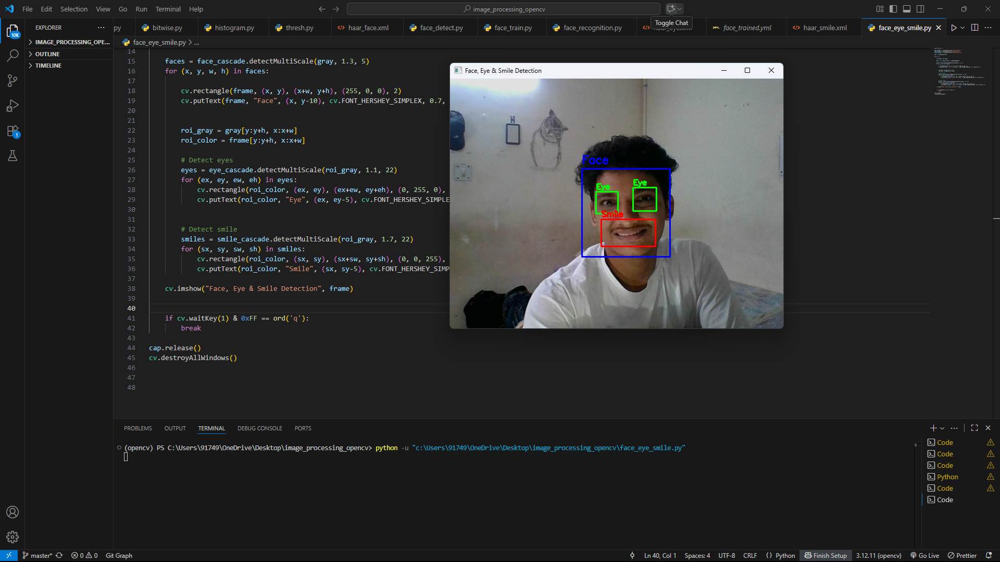

# Real-Time Face, Eye & Smile Detection using OpenCV

  

---

## Project Overview
This project demonstrates a **real-time facial feature detection system** using Python and OpenCV.  
It detects **faces, eyes, and smiles** through a webcam feed using **Haar Cascade Classifiers**, providing a practical application of computer vision techniques.

---

## Features
- Real-time detection of faces, eyes, and smiles.  
- Handles multiple faces in a single frame.  
- Uses Haar Cascade models for efficient and accurate detection.  
- Easy to run and extend for additional facial feature recognition.

---

## Tools & Technologies
- **Python** – programming language  
- **OpenCV** – computer vision library for image/video processing  
- **Haar Cascade Classifiers** – pre-trained detection models  
- **VS Code / Jupyter Notebook** – development environment  
- **Webcam** – live video input
